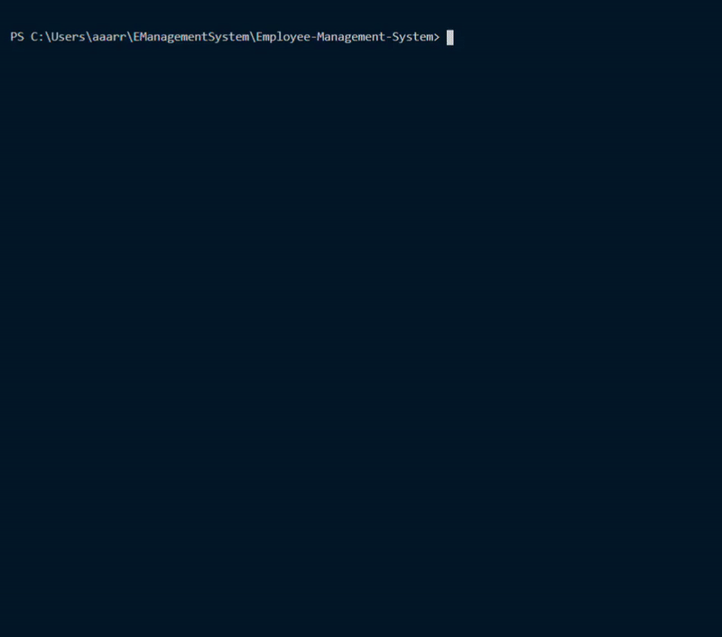

# Application: Employee-Management-System

## Description:
SQL based employee database using inquirer

## Table of Contents:
  [Intallation Steps](#installSteps)  

  [Instructions](#instructions)  

  [License](#license)  

  [Contributing](#contributing)  

  [Tests](#tests)  

  [Questions](#questions)  

  [Video](#video)  

  [Links](#links)  

## Installation Dependencies:
npm install

## Instructions:
Run 'npm start', follow the prompts

## License:
None

## Contributing Information:
Contact author.

## Tests:
no test scripts

## Questions:

If you have any questions, open an issue or contact rureed at undefined.

## Video:

## Links:
https://github.com/rureed/Employee-Management-System

